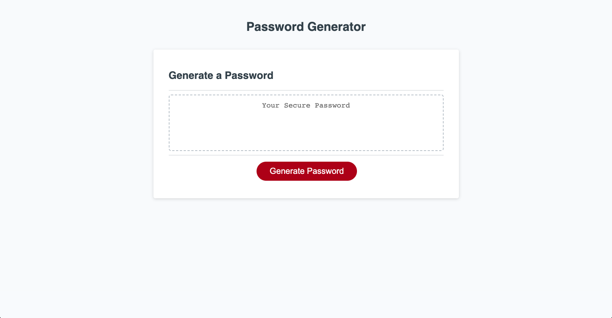

# Password Generator

## Description

This application allows the user to generate a random password that meets certain criteria of their choosing, providing a larger measure of security. The user will begin by clicking the 'Generate Password' button, and follow a set of prompts to formulate their new password.

## Usage

The following link leads to the deployed application.

https://miamauro.github.io/password-generator/

The following image shows a screenshot of the deployed application.

